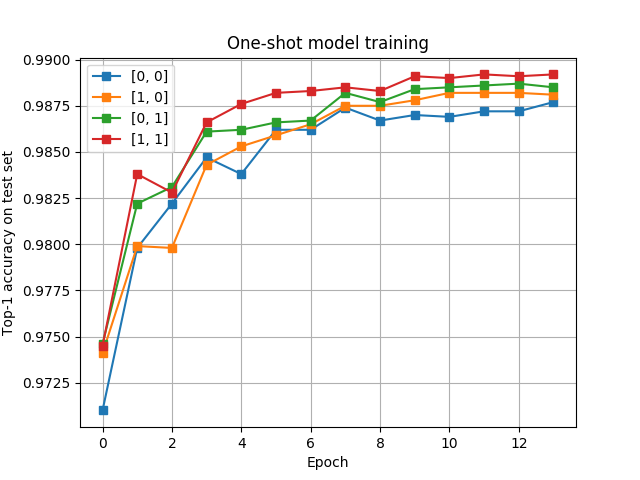
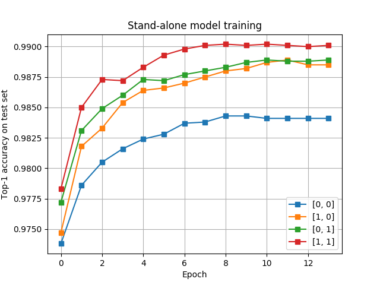
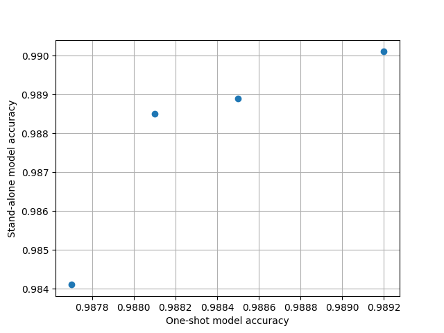
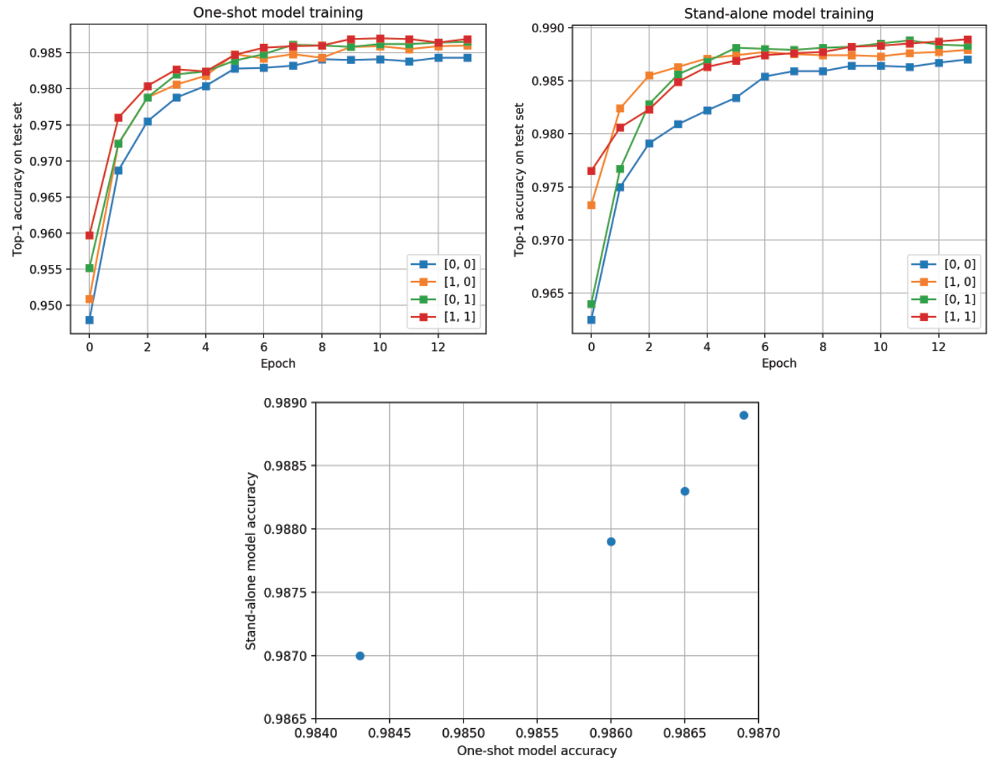

## Goal
Train a SuperNet that contains 4 architectures/subnets on MNIST dataset. The architectures are shown below:


### Intro
The goal of neural architecture search (NAS) is automating the process of finding the best architectures of DNNs for a given task, e.g. computer vision.
Weight-sharing is currently one of the most promising approaches to NAS.

The main advantage of the weight-sharing approach is that a SuperNet, whose size grows linearly with the number of alternative elements per layer, covers a search space of architectures that is exponential in this number of elements.
Thus, a careful training of one SuperNet (one-shot) allows evaluating a large number of candidate architectures.
Depending on implementation, this approach does not require hyperparameter optimization nor an external controller like a RL or evolution algorithm.

Among the challenges of this approach is a possible performance difference between one-shot-trained subnets and the same subnets trained from scratch, instability during training, and possible interaction/co-adaptation of subnets due to weight-sharing.
Overall it is a useful approach, that allows at least to strongly narrow down the search space.
Here, we implement a simple SuperNet that contains four subnets and train it on MNIST dataset.

### Technical details
- The DNN's are implemented using PyTorch library, we use Adadelta optimizer
- We deliberately use a small number of filters for conv layers (8) to be able to see differences between architectures
- During one-shot training a subnet is sampled randomly at each iteration (for each minibatch) and only its weights are updated
- There seem to be several ways to implement weight-sharing, as shown below:


(A) `SuperNetSum`: The outputs of the alternative conv layers are added, such that the data tensor after SUM has the same size as after the conv elements.
In this case, weights of the following layer are fully shared.

(B) `SuperNetConcat`: The outputs of the alternative conv layers are concatenated followed by 1x1 conv to reduce the size of the data tensor.

(C) The outputs of the alternative conv layers are concatenated and passed on to the next layer.
The size of the output data tensor depends in this case on the nuumber of alternative conv elements, and the weights of the next layer are not fully shared.

We use approaches (A) and (B). The approach (C) does not seem to be a good one if the number of alternative conv elements is large.

Weight sharing is implemented in the `forward()` method of SuperNet as follows. For (A):

```
x = self.conv1(x) * (1 - self.choice) + self.conv2(x) * self.choice
```

And for (B):

```
x = torch.cat((self.conv11(x)*(1-self.choice), self.conv12(x)*self.choice), dim=1)
x = self.conv1_1x1(x)
```

Parameter `choice` controls which convolution is switched on.
This simple approach works, because the computational graph is built during a `forward()` pass, which is called at every iteration (for every minibatch).
Then `backward()` pass + `optimizer.step()` correctly update the weights of only the conv layers that are switched on.
This implementation does not require any parameter/weight copying during training.

### Results

One-shot training of SuperNet (`SuperNetSum`) is performed and after each epoch top-1 accuracy on a test set is evaluated for each of the four subnets:



The subnets or architectures are labelled as [x y], where x/y indicates switching on 3x3 layer (0) or 5x5 layer (1) inside the first/second block in the network.

Next, each of the four subnets is trained separately:



Is one-shot performance predictive of the intrinsic performance after convergence? We plot one against the other (after the last training epoch):



There is strong correlation, and the ranking of the architectures is predicted correctly.
Generally, stand-alone training yields a better performance than one-shot training as expected. The only exception is the [0,0] subnet.

The same experiment is repeated for `SuperNetConcat`:




### Outlook

One of the most intriguing observations in
[[Bender2018](http://proceedings.mlr.press/v80/bender18a/bender18a.pdf)] is that symmetrized KL divergence between predictions of a subnet and the reference network
on a training set strongly correlates to the subnet performance on the test set.
It might be worth looking if this is a more general phenomenon and KL divergence is a fundamental way of measuring distance between architectures.

