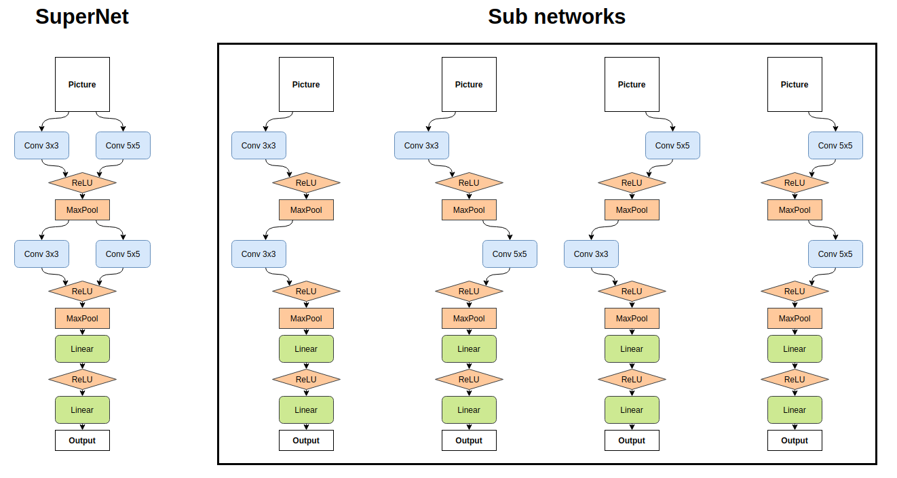
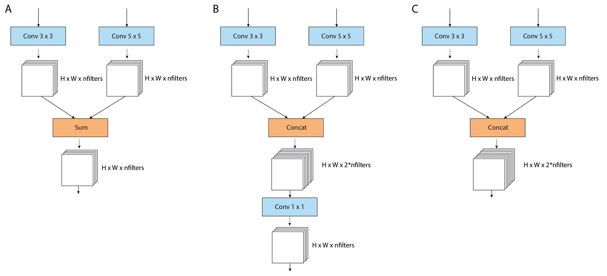

# Цель
Обучить суперсеть, включающую в себя 4 сети, на датасете MNIST. Ниже показана архитектура SuperNet, которая покрывает пространство, состоящее из 4-х архитектур (на картинке справа).
Свертки не меняют высоту и ширину входного тензора.

### Intro
The goal of neural architecture search (NAS) is automating the process of finding the best architectures of DNNs for a given task, e.g. computer vision.
Weight-sharing is currently one of the most promising approaches to NAS.

The main advantage is that a SuperNet, whose size grows linearly with the number of alternative elements per layer, covers a search space of architectures that is exponential in this number of elements.
Thus, a careful training of one SuperNet (one-shot) allows evaluating a large number of candidate architectures.
Depending on the implementation, this approach does not require hyperparameter optimization nor an external controller like a RL or evolution algorithm.

Among the challenges of this approach is a possible performance difference between one-shot trained subnets and the same subnets trained from scratch, instability during training, and possible interaction/co-adaptation of subnets due to weight-sharing.
Overall it is a useful approach, that allows at least to strongly narrow down the search space.
Here, we implement a simple SuperNet, that contains four subnets, and train it on MNIST dataset.

### Technical details
- The DNN's are implemented using PyTorch library, we use Adadelta optimizer
- We deliberately use a small number of filters for conv layers (16) to be able to see differences between architectures
- During one-shot training a subnet is sampled randomly at each iteration (for each minibatch) and only its weights are updated
- There seem to be several ways to combine the subnets into a SuperNet, shown below:

(A) The outputs of the alternative conv layers are added, such that the data tensor after SUM has the same size as after conv elements.
In this case, weights of the following layer are fully shared.

(B) The outputs of the alternative conv layers are concatenated followed by 1x1 conv to reduce the size of the data tensor.

(C) The outputs of the alternative conv layers are concatenated and passed on to the next layer. The size of the data tensor depends in this case on the nuumber of alternative conv elements, and the weights of the next layer are not fully shared.

We use approach (A), and then repeat some experiment for (B). In the code, weight sharing is implemented in the 'forward()' method of the SuperNet as follows. For (A):

'''
x = self.conv1(x) * (1 - self.choice) + self.conv2(x) * self.choice
'''

And for (B):

'''
x = torch.cat((self.conv11(x)*(1-self.choice), self.conv12(x)*self.choice), dim=1)
x = self.conv1_1x1(x)
'''

Parameter 'choice' controls which convolution is switched on. This simple approach works, because the computational graph is built during a forward pass, which is called at every iteration (for every minibatch). The backward pass + optimizer step update the weights correctly.
This seems to be a simple and effective implementation that does not require and parameter copying on the fly.implement

### Results
